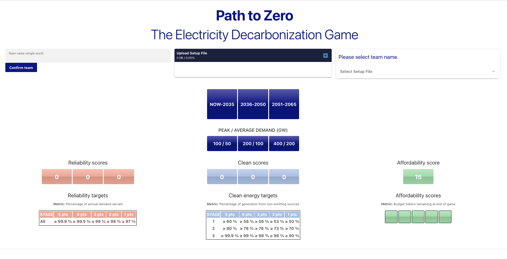
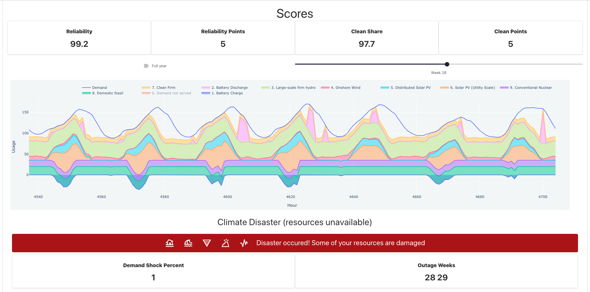

[comment]: # (This presentation was made with markdown-slides)
[comment]: # (Can be found here: https://gitlab.com/da_doomer/markdown-slides)
[comment]: # (Compile this presentation with the command below)
[comment]: # (mdslides slides.md)

[comment]: # (Set the theme:)
[comment]: # (THEME = white)
[comment]: # (CODE_THEME = github)

[comment]: # (controls: true)
[comment]: # (keyboard: true)
[comment]: # (markdown: { smartypants: true })
[comment]: # (hash: false)
[comment]: # (respondToHashChanges: false)

WebAssembly (and Rust)

 

### Andres Rios Tascon

RSE Group Meeting. Jan 22nd, 2025

[comment]: # (!!!)

### What is WASM?

WebAssembly (abbreviated WASM) is a binary instruction format for a (stack-based) virtual machine.

You could think of it as something like Java, but taylored to work with the web by working alongside JavaScript.

[comment]: # (!!!)

### Not a new idea

Things like this have existed in the past. For example Adobe Flash used to be pretty popular back in the day.

[comment]: # (!!!)

### What sets it apart?

- Performance
- Security
- Portability
- Language support
- Open standard (W3C)

[comment]: # (!!!)

### Why should I care?

RSEs could benefit from it for a variety of reasons

- Greatly improves software accessibility
- No need to maintain a server
- Trainings and events require no participant setup

[comment]: # (!!!)

### Some interesting examples

- [Pyodide](https://github.com/pyodide/pyodide) [[Demo](https://pyodide.org/en/stable/console.html)]
- [JupyterLite](https://github.com/jupyterlite/jupyterlite) [[Demo](https://jupyterlite.rtfd.io/en/stable/try/lab)]
- [abSENSE](https://princetonuniversity.github.io/abSENSE/)
- [xkcd comic](https://xkcd.com/2916/)
- [WebVM](https://webvm.io/) and [WebVM with graphics](https://webvm.io/alpine.html)
- [Doom 3](https://wasm.continuation-labs.com/d3demo/)

[comment]: # (!!!)

### Beyond bare metal

Once you need different pieces to interface with each other, you'll need another layer that provides OS-like functionality.

The two options you'll run into are Emscripten and WASI.

[comment]: # (|||)

### Emscripten

- It's a complete toolchain for WASM
- Very fast moving, as it is not based on standards
- Compatibility only guaranteed within a single version
- Already offers a lot of functionality

[comment]: # (|||)

### WASI

- Stands for WebAssembly System Interface
- It is a set of interface standards for WASM
- It moves slowly and it is still pretty limited
- It will be very powerful in the future

[comment]: # (!!!)

### Let's dip our toes and build a simple website with WASM

[comment]: # (!!!)

### [Example 1](https://github.com/ariostas-talks/2025-01-22-rse-group-meeting-wasm/tree/main/example1)

In this simple example we make an website to compute Fibonacci numbers.

[comment]: # (!!!)

# Now let's move on to Rust!

[comment]: # (||| data-auto-animate)

# Now let's move on to Rust!

Yes, I duped you into listening to yet another Rust talk. It was in white in the title slide.

[comment]: # (!!! data-auto-animate)

WebAssembly (and Rust)

 

### Andres Rios Tascon

RSE Group Meeting. Jan 22nd, 2025

[comment]: # (!!!)

### Rust and WASM

In my opinion, Rust is the go-to language to write a WASM app.

- It offers tier 2 support for `wasm32-*` targets.
- Outstanding toolchain makes development very easy.
- Excellent web frameworks to choose from, including: [Dioxus](https://github.com/dioxuslabs/dioxus), [egui](https://github.com/emilk/egui), [Leptos](https://github.com/leptos-rs/leptos), [Yew](https://github.com/yewstack/yew)

[comment]: # (!!!)

### [Example 2](https://github.com/ariostas-talks/2025-01-22-rse-group-meeting-wasm/tree/main/example2)

Let's see how to replicate example 1, but now in Rust (using Leptos).

[comment]: # (!!!)

### Scaling up

These previous examples are pretty trivial. I wanted to do something actually useful.

[comment]: # (!!!)

A couple months ago, Luca showed us his really nice "Path to Zero" Electricity Decarbonization Game.

[comment]: # (||| data-auto-animate)

A couple months ago, Luca showed us his really nice "Path to Zero" Electricity Decarbonization Game.

During the hackathon that kickstarted its development, I wanted to try using Rust to build it in WASM. It was unfeasible in the given time.

[comment]: # (||| data-auto-animate)

A couple months ago, Luca showed us his really nice "Path to Zero" Electricity Decarbonization Game.

During the hackathon that kickstarted its development, I wanted to try using Rust to build it in WASM. It was unfeasible in the given time.

I made a proof of concept for this presentation.

[comment]: # (!!! data-auto-animate)

The things that I considered key to get it working were the following.

- Dataframes (not completely essential, but nice)
- Linear optimizer
- Plotting functionality

[comment]: # (!!!)

### [Example 3](https://github.com/ariostas-talks/2025-01-22-rse-group-meeting-wasm/tree/main/example3)

Path to Zero game proof of concept.

[comment]: # (!!!)

### Conclusions

- WASM seems to have a bright future

[comment]: # (||| data-auto-animate)

### Conclusions

- WASM seems to have a bright future
- It is potentially very useful for RSEs, as it greatly simplifies the sharing of software

[comment]: # (||| data-auto-animate)

### Conclusions

- WASM seems to have a bright future
- It is potentially very useful for RSEs, as it greatly simplifies the sharing of software
- Rust is cool

[comment]: # (!!! data-auto-animate)

Questions?
